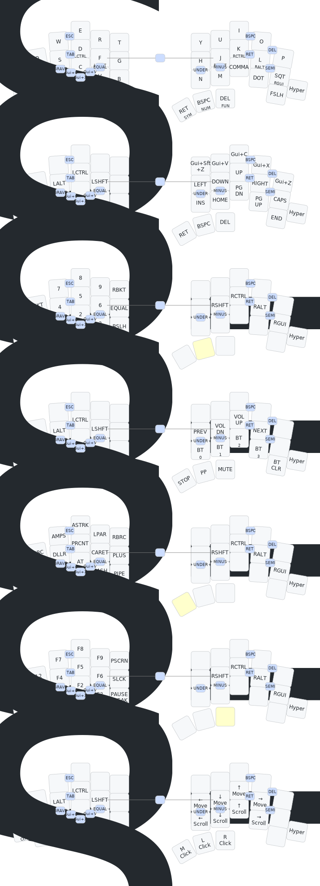

# TOTEM — ZMK Firmware Config

[](../../actions/workflows/build.yml)

> Miryoku-inspired ZMK configuration for the [TOTEM](https://github.com/GEIGEIGEIST/TOTEM) 38-key split keyboard, with [ZMK Studio](https://zmk.studio/) support for real-time keymap editing.

---

## Keymap



*Auto-generated with [keymap-drawer](https://github.com/caksoylar/keymap-drawer) on every push.*

---

## Layout Philosophy

This config follows the [Miryoku](https://github.com/manna-harbour/miryoku) layout system — a minimal 36-key layout that puts everything within one key of the home row.

- **QWERTY** base with **home row mods** (GACS order)
- **Vim-style** navigation (HJKL arrows)
- **6 thumb-activated layers** — no combos, no chords, just hold a thumb key
- **Symmetric design** — left thumbs activate right-hand layers and vice versa
- **Extra keys** — Ctrl/Esc (left) and Hyper (right) on the outer bottom row

### Extra Keys

| Position | Tap | Hold | Use Case |
|:---------|:----|:-----|:---------|
| Left outer | Esc | Ctrl | Vim escape + Ctrl shortcuts without leaving home row |
| Right outer | — | Hyper (GUI+Alt+Ctrl+Shift) | Raycast/launcher shortcuts with a clean modifier namespace |

### Thumb Keys

```
Left hand                          Right hand
┌───────────┬───────────┬────────┐ ┌─────────┬──────────┬─────────┐
│ MEDIA/ESC │  NAV/SPC  │MOUSE/TAB│ │ SYM/ENT │ NUM/BSPC │ FUN/DEL │
└───────────┴───────────┴────────┘ └─────────┴──────────┴─────────┘
```

### Layers at a Glance

| Layer | Activation | Left Hand | Right Hand |
|:------|:-----------|:----------|:-----------|
| BASE | Default | QWERTY + home row mods | QWERTY + home row mods |
| NAV | Hold `Space` | Mods | Vim arrows, clipboard, PgUp/PgDn, Home/End |
| MOUSE | Hold `Tab` | Mods | Mouse move, scroll, L/M/R click |
| MEDIA | Hold `Esc` | Mods | Prev/Next, Vol, Play/Stop, BT profiles |
| NUM | Hold `Bspc` | `[ 7 8 9 ]`, `; 4 5 6 =`, `` ` 1 2 3 \ `` | Mods |
| SYM | Hold `Enter` | `{ & * ( }`, `: $ % ^ +`, `~ ! @ # \|` | Mods |
| FUN | Hold `Del` | F12-F1, PrtSc, ScrLk, Pause | Mods |

### Home Row Mods

```
Left:   GUI / A    ALT / S    CTRL / D    SHFT / F
Right:  SHFT / J   CTRL / K   ALT / L     GUI / '
```

| Setting | Value |
|:--------|:------|
| Flavor | tap-preferred |
| Tapping term | 200 ms |
| Quick tap | 175 ms |
| Require prior idle | 150 ms |

---

## Hardware

| | |
|:--|:--|
| **Keyboard** | [TOTEM](https://github.com/GEIGEIGEIST/TOTEM) — 38-key columnar stagger split |
| **MCU** | Seeeduino XIAO BLE (nRF52840) |
| **Firmware** | [ZMK](https://zmk.dev/) main branch (Zephyr 4.1) |
| **Studio** | Enabled on left half — edit keymap live at [zmk.studio](https://zmk.studio/) |

---

## Getting the Firmware

Firmware builds automatically via GitHub Actions on every push.

1. Go to the [Actions](../../actions) tab
2. Open the latest successful **Build ZMK firmware** run
3. Download the `totem_left` and `totem_right` artifacts (`.uf2` files)

### Flashing

1. Double-tap the reset button on the XIAO BLE to enter bootloader mode
2. A USB drive will appear — drag the `.uf2` file onto it
3. Flash left half first (`totem_left`), then right (`totem_right`)

---

## ZMK Studio

[ZMK Studio](https://zmk.studio/) lets you edit your keymap in real time through a browser — no reflashing, no rebuilding, no code.

### What You Can Do

- Remap any key on any layer
- Add, remove, or reorder layers
- Configure hold-tap behaviors
- Test changes instantly — they apply the moment you make them
- Save layouts that persist across reboots

### How to Connect

1. **Plug in the left half** via USB (Studio is only enabled on the left half)
2. Open [zmk.studio](https://zmk.studio/) in a WebUSB-compatible browser (Chrome, Edge, or Brave)
3. Click **Connect** and select your TOTEM from the device list
4. Your current keymap loads automatically — start editing

### How It Works

- Changes apply **instantly** to the keyboard — no compile or flash step
- Edits are saved to the keyboard's **onboard flash**, so they survive reboots and unplugging
- The `.keymap` file in this repo is the **default layout** — Studio overrides sit on top of it
- To reset back to the defaults from this repo, use the **Restore Stock Settings** option in Studio

### Connecting via Bluetooth

You can also connect to Studio over BLE:

1. Make sure the left half is **not** plugged in via USB
2. Open [zmk.studio](https://zmk.studio/) and click **Connect via Bluetooth**
3. Pair with the TOTEM if prompted
4. Edit your keymap wirelessly

> **Note:** WebBluetooth support varies by OS. Chrome on macOS/Linux works best. Windows may require flags.

### Build Config

Studio support is configured in `build.yaml` for the left half:

```yaml
- board: xiao_ble//zmk
  shield: totem_left
  snippet: studio-rpc-usb-uart
  cmake-args: -DCONFIG_ZMK_STUDIO=y -DCONFIG_ZMK_STUDIO_LOCKING=n
```

- `CONFIG_ZMK_STUDIO=y` — enables the Studio RPC endpoint
- `CONFIG_ZMK_STUDIO_LOCKING=n` — disables the security lock so you don't need to confirm on the keyboard each time
- `snippet: studio-rpc-usb-uart` — routes Studio communication over USB serial

---

## Repository Structure

```
├── config/
│   ├── totem.keymap        # Keymap definition
│   ├── totem.conf          # Firmware config options
│   └── west.yml            # ZMK module manifest
├── boards/shields/totem/   # Board shield definition
├── keymap-drawer/          # Auto-generated keymap diagrams
│   ├── config.yaml         # Diagram styling config
│   ├── totem.yaml          # Parsed keymap data
│   └── totem.svg           # Visual keymap diagram
├── build.yaml              # GitHub Actions build matrix
└── .github/workflows/
    ├── build.yml            # Firmware build workflow
    └── draw-keymaps.yml     # Keymap diagram generator
```

---

## Credits

- [TOTEM](https://github.com/GEIGEIGEIST/TOTEM) keyboard by GEIGEIGEIST
- [Miryoku](https://github.com/manna-harbour/miryoku) layout by Manna Harbour
- [ZMK Firmware](https://zmk.dev/)
- [keymap-drawer](https://github.com/caksoylar/keymap-drawer) by caksoylar
